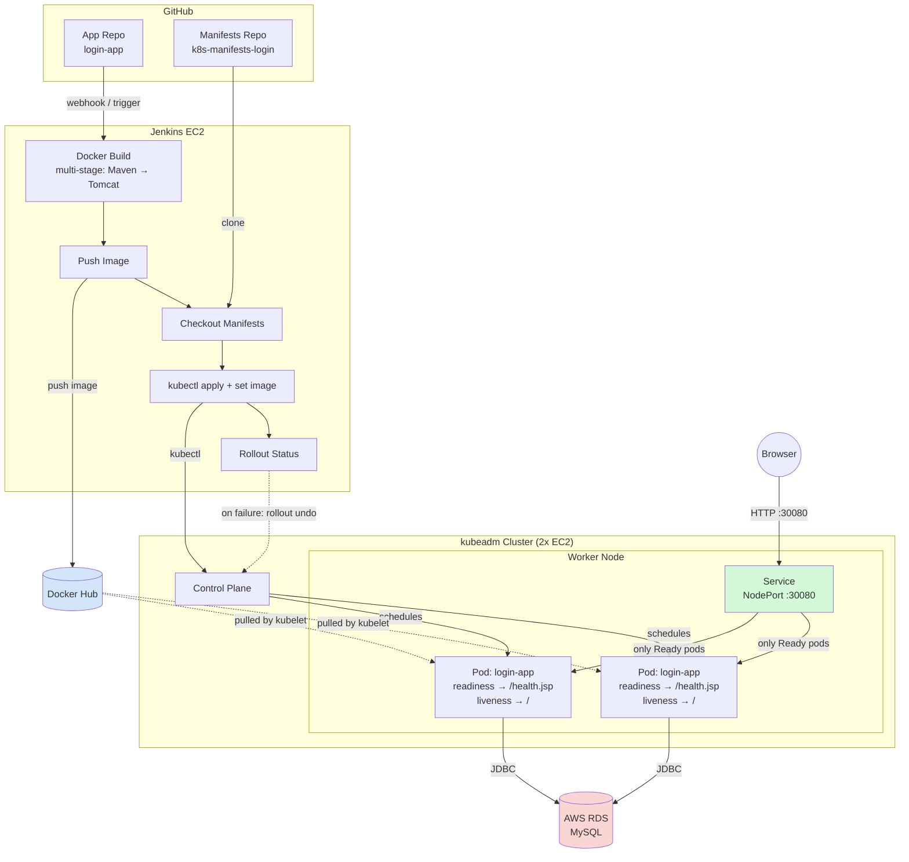
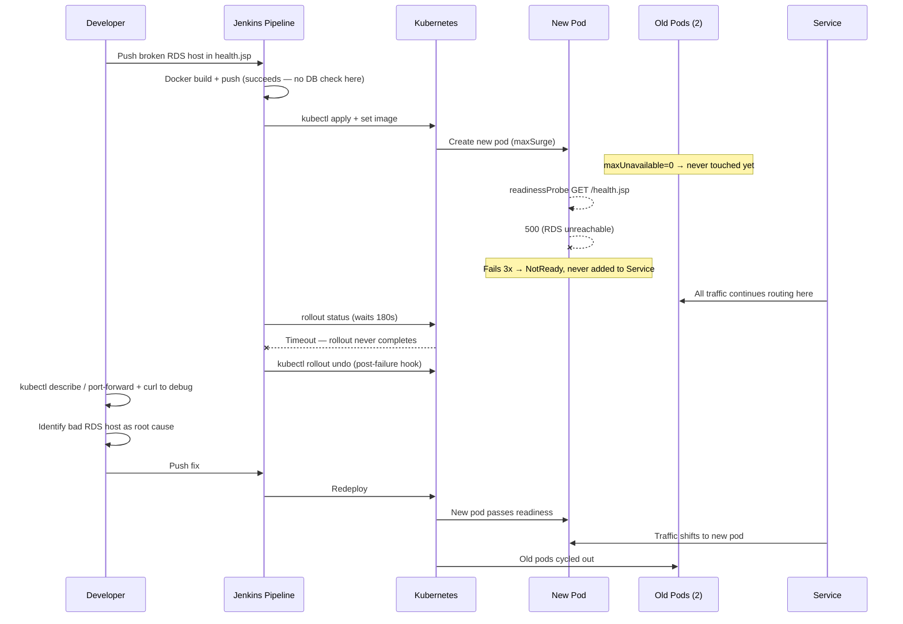

# Login App — Kubernetes Deployment, CI/CD, and Reliability Engineering

A minimal production-style Java web application deployed to a self-managed Kubernetes cluster, with a fully automated CI/CD pipeline, an explained reliability improvement, and a documented live failure simulation.

This project was built to demonstrate infrastructure quality — containerization, deployment automation, observability, and operational debugging — rather than application complexity.

---

## Table of Contents

1. [Architecture Overview](#architecture-overview)
2. [Working Deployment](#1-working-deployment)
3. [CI/CD Pipeline](#2-cicd-pipeline)
4. [Reliability Improvement — Readiness & Liveness Probes](#3-reliability-improvement--readiness--liveness-probes)
5. [Intentional Failure Simulation](#4-intentional-failure-simulation)
6. [Jenkins Access Control — Scoped ServiceAccount & RBAC](#5-jenkins-access-control--scoped-serviceaccount--rbac)
7. [Observability — Prometheus & Grafana](#6-observability--prometheus--grafana)
8. [Key Engineering Decisions & Tradeoffs](#key-engineering-decisions--tradeoffs)
9. [What I'd Do Differently in a Larger Production Setting](#what-id-do-differently-in-a-larger-production-setting)

---

## Architecture Overview

> The diagram below shows the core 2-node application deployment (Sections 1–4). The cluster later grew to 3 nodes with a dedicated, isolated monitoring node — see [Section 6](#6-observability--prometheus--grafana) for that part of the architecture and why it's kept separate.



<details>
<summary>Text-based diagram (fallback if Mermaid doesn't render)</summary>

```
┌───────────────────────────────────────────────────────────┐
│                         AWS (single VPC)                   │
│                                                             │
│  ┌─────────────────┐                                       │
│  │   Jenkins EC2     │                                      │
│  │  (master+worker)  │                                      │
│  └────────┬──────────┘                                      │
│           │ 1. build image  2. push to Docker Hub           │
│           │ 3. apply manifests  4. kubectl set image        │
│           ▼                                                 │
│  ┌───────────────────────────────────────────────────┐      │
│  │        kubeadm Kubernetes Cluster (EC2)            │      │
│  │                                                     │      │
│  │  Control Plane EC2                                 │      │
│  │  Worker Node EC2                                    │      │
│  │    └── login-app Deployment (2 replicas)            │      │
│  │         readinessProbe → /health.jsp (checks DB)    │      │
│  │         livenessProbe  → /        (checks process)  │      │
│  │    └── login-app-service (NodePort :30080)          │      │
│  └──────────────────────┬──────────────────────────────┘      │
│                          │ JDBC (MySQL)                       │
│                          ▼                                    │
│                 ┌──────────────────┐                          │
│                 │   AWS RDS MySQL   │                          │
│                 │   (db.t3.micro)   │                          │
│                 └──────────────────┘                          │
└───────────────────────────────────────────────────────────┘

Docker Hub ← image pushed here by Jenkins
GitHub     ← two repos: app source, and Kubernetes manifests
```

</details>

**Repositories:**
- App source: `login-app` (Java/JSP, Maven, Dockerfile, Jenkinsfile)
- Kubernetes manifests: `k8s-manifests-login` (deployment.yaml, service.yaml)

Manifests are kept in a **separate repository** from application code deliberately — this keeps infrastructure config independently versioned and reviewable from application changes, and is a step toward a GitOps-style separation of concerns even though this project uses Jenkins to apply changes directly rather than a pull-based tool like ArgoCD.

---

## 1. Working Deployment

**Stack:**
- **Backend:** Java web app (JSP/Servlet, login + registration), packaged as a WAR, served by Apache Tomcat 9
- **Database dependency:** AWS RDS (MySQL), external to the cluster
- **Cluster:** Self-managed Kubernetes via `kubeadm` on two EC2 instances (1 control plane, 1 worker — both t3.small)
- **Containerization:** Multi-stage Docker build (Maven build stage → lean Tomcat runtime stage)

**Why RDS instead of running MySQL as a pod:**
Running the database as a managed external service better reflects a real production pattern, avoids introducing StatefulSet/PersistentVolume complexity that wasn't the focus of this assessment, and gives a genuine external dependency to fail against in the reliability and failure-simulation sections.

**Verification:**
```bash
kubectl get pods -n default
# NAME                          READY   STATUS    RESTARTS   AGE
# login-app-7d9646d89f-6q9ht    1/1     Running   0          1h
# login-app-7d9646d89f-lcv7v    1/1     Running   0          1h
```

App is reachable at `http://<worker-node-ip>:30080/`, and both login and registration flows work end-to-end against RDS.

---

## 2. CI/CD Pipeline

**Tool:** Jenkins (master and worker combined on a single EC2 for this assessment)

**Pipeline stages:**
1. **Docker Build** — multi-stage build compiles the WAR with Maven and packages it into a Tomcat image
2. **Push to Docker Hub** — tagged with the Jenkins `BUILD_NUMBER` and `latest`
3. **Checkout Manifests Repo** — clones the separate manifests repository
4. **Deploy to Kubernetes** — applies the manifests (probes, resources, replica count) *and* patches the image tag, then waits on rollout status
5. **Post-build** — on success, confirms the live image tag; on failure, automatically runs `kubectl rollout undo`

```groovy
stage('Deploy to Kubernetes') {
    steps {
        withCredentials([file(credentialsId: 'kubeconfig-cred-id', variable: 'KUBECONFIG')]) {
            sh """
                kubectl apply -f manifests/deployment.yaml -n default
                kubectl apply -f manifests/service.yaml -n default

                kubectl set image deployment/login-app \
                    login-app=${DOCKERHUB_REPO}:${IMAGE_TAG} -n default

                kubectl rollout status deployment/login-app -n default --timeout=180s
            """
        }
    }
}
post {
    failure {
        sh 'kubectl rollout undo deployment/login-app -n default'
    }
}
```

**A real design decision worth calling out:** the pipeline initially used only `kubectl set image` to deploy, which patches the image field but silently ignores any other change made in the manifests (probe paths, resource limits, replica count). This was caught during testing — a probe path change committed to the manifests repo never actually took effect on the live cluster, because `set image` doesn't reconcile the rest of the spec. The fix was to explicitly `kubectl apply -f` the full manifest *and then* patch the image tag, so both manifest-level config and the specific build's image are applied together on every run.

**Jenkins → Cluster connectivity:** the Jenkins agent authenticates to the `kubeadm` API server using a kubeconfig stored as a Jenkins secret file credential, injected via `withCredentials` only for the duration of the deploy stage rather than sitting on disk permanently.

---

## 3. Reliability Improvement — Readiness & Liveness Probes

**Why I chose this:**
Of the available options, probes address the most fundamental gap in a bare Kubernetes deployment: without them, Kubernetes has no way to distinguish between "the container process is running" and "the application is actually able to serve correct responses." A container can be `Running` while its only real dependency — the database — is completely unreachable, and Kubernetes would happily keep routing user traffic to it.

**What problem it solves:**
- **Readiness probe** (`GET /health.jsp`) performs a real JDBC connection attempt to RDS. If it fails, the pod is removed from the Service's endpoint list automatically — no user traffic is ever routed to a pod that can't reach its database.
- **Liveness probe** (`GET /`) checks that the Tomcat process itself is still responsive, independent of the database. If this fails, Kubernetes kills and restarts the container, since an unresponsive process may recover from a fresh start.

```yaml
readinessProbe:
  httpGet:
    path: /health.jsp
    port: 8080
  initialDelaySeconds: 15
  periodSeconds: 10
  timeoutSeconds: 5
  failureThreshold: 3

livenessProbe:
  httpGet:
    path: /
    port: 8080
  initialDelaySeconds: 30
  periodSeconds: 15
  timeoutSeconds: 5
  failureThreshold: 3
```

Deployed alongside a rolling update strategy of `maxUnavailable: 0, maxSurge: 1`, so the readiness probe becomes the actual gate controlling the pace of every rollout — a new pod cannot receive traffic or cause an old pod's removal until it proves itself healthy.

**What tradeoff it introduces:**
1. **Tuning complexity.** `initialDelaySeconds` has to match real application startup time; too short and a slow-starting container gets marked unhealthy before it's finished booting, too long and a genuinely broken pod stays in rotation longer than necessary.
2. **A subtler tradeoff discovered during testing:** readiness and liveness were initially pointed at the *same* DB-dependent endpoint. When RDS was unreachable, this caused a restart loop — the liveness probe kept killing and restarting a container that was otherwise perfectly healthy, since a restart can never fix an external database outage. The two checks were split so liveness only verifies the process itself, and readiness alone is responsible for dependency health. This is the more correct interpretation of what each probe type is meant to verify.
3. **Default probe timeout was too aggressive.** The default `timeoutSeconds: 1` occasionally caused a transient readiness failure under normal RDS latency (`context deadline exceeded`), visible as a one-off `Unhealthy` event even when the pod was otherwise fine. `timeoutSeconds` was explicitly raised to `5` to give a live JDBC connection realistic headroom without slowing down detection of an actually broken pod.

---

## 4. Intentional Failure Simulation

**Scenario:** Database connectivity failure, triggered by intentionally pointing `health.jsp`'s RDS hostname at an invalid endpoint and deploying it through the normal CI/CD pipeline — exactly how a real bad configuration change would ship.



### Show the failure

The build and push succeeded, since neither step validates runtime DB connectivity — the failure only surfaced once the new pod was actually running:

```
NAME                         READY   STATUS    RESTARTS   AGE
login-app-6676f8949b-7x7h4   0/1     Running   0          4m29s   ← new, broken
login-app-7d9646d89f-6q9ht   1/1     Running   0          59m     ← old, healthy
login-app-7d9646d89f-lcv7v   1/1     Running   0          58m     ← old, healthy
```

### Debug it

```bash
kubectl describe pod login-app-6676f8949b-7x7h4 -n default
```
```
Warning  Unhealthy  Readiness probe failed:
HTTP probe failed with statuscode: 500
```

```bash
kubectl port-forward login-app-6676f8949b-7x7h4 8888:8080 -n default
curl -s -w "\nHTTP Status: %{http_code}\n" http://localhost:8888/health.jsp
```
```
DB connection failed: Communications link failure
The last packet sent successfully to the server was 0
milliseconds ago. The driver has not received any
packets from the server.
HTTP Status: 500
```

```bash
kubectl get endpoints login-app-service -n default
```
```
# Only the two healthy pod IPs listed — the broken pod
# was never added to the Service's routing table.
```

### Reasoning

`kubectl describe pod` narrowed the failure to the readiness probe specifically, not a crash or image pull issue. Port-forwarding directly into the broken pod and re-issuing the exact same HTTP call the probe makes reproduced the precise underlying exception — a MySQL communications failure — confirming the root cause was network/host-level (unreachable endpoint), not a credentials or application-logic problem. Checking the Service's endpoint list confirmed the practical impact: because `maxUnavailable: 0` was set, the two old healthy pods were never removed, so the Service continued routing 100% of traffic to working pods for the entire incident. The rollout stalled waiting for the new pod to become ready, timed out per `kubectl rollout status --timeout=180s`, failed the Jenkins pipeline stage, and triggered the pipeline's `kubectl rollout undo` in the `post { failure { ... } }` block.

### Fix it

Reverted the RDS hostname in `health.jsp` to the correct endpoint, committed, and let the same pipeline redeploy it:

```bash
kubectl get pods -n default
# NAME                          READY   STATUS    RESTARTS   AGE
# login-app-58448c598b-97hw8    1/1     Running   0          2m45s
# login-app-7d9646d89f-6q9ht    1/1     Running   0          63m

curl -s -w "\nHTTP Status: %{http_code}\n" http://<worker-node-ip>:30080/health.jsp
# OK
# HTTP Status: 200
```

**End-user impact throughout the entire incident: zero.** The Service never routed a single request to the broken pod, at any point.

---

## 5. Jenkins Access Control — Scoped ServiceAccount & RBAC

The pipeline initially authenticated to the cluster using the full cluster-admin `kubeconfig` (`/etc/kubernetes/admin.conf`) generated by `kubeadm`. This was replaced with a namespace-scoped Kubernetes `ServiceAccount`, so a compromised or misbehaving Jenkins credential can only affect exactly what the pipeline is supposed to touch.

**What was created:**
```yaml
apiVersion: v1
kind: ServiceAccount
metadata:
  name: jenkins-deployer
  namespace: default
---
apiVersion: rbac.authorization.k8s.io/v1
kind: Role
metadata:
  name: jenkins-deploy-role
  namespace: default
rules:
- apiGroups: ["apps"]
  resources: ["deployments"]
  verbs: ["get", "list", "watch", "create", "update", "patch"]
- apiGroups: [""]
  resources: ["services"]
  verbs: ["get", "list", "watch", "create", "update", "patch"]
- apiGroups: [""]
  resources: ["pods", "pods/log", "endpoints"]
  verbs: ["get", "list", "watch"]
- apiGroups: ["apps"]
  resources: ["replicasets"]
  verbs: ["get", "list", "watch"]
---
apiVersion: rbac.authorization.k8s.io/v1
kind: RoleBinding
metadata:
  name: jenkins-deploy-binding
  namespace: default
subjects:
- kind: ServiceAccount
  name: jenkins-deployer
  namespace: default
roleRef:
  kind: Role
  name: jenkins-deploy-role
  apiGroup: rbac.authorization.k8s.io
```

**Deliberately excluded:** `delete` on any resource, and any access outside the `default` namespace or to cluster-scoped resources (e.g. `nodes`). The pipeline never needs to remove anything or see outside the app's own namespace.

A short-lived bearer token was generated for the ServiceAccount (`kubectl create token jenkins-deployer`) and assembled into a standalone `kubeconfig`, uploaded to Jenkins as a `Secret file` credential under the same credential ID the pipeline already referenced — meaning the `Jenkinsfile` itself required zero changes to adopt the scoped identity.

**Verifying the scoping is real, not just configured:**
```bash
KUBECONFIG=jenkins-kubeconfig.yaml kubectl get pods -n default
# works — within granted permissions

KUBECONFIG=jenkins-kubeconfig.yaml kubectl delete deployment login-app -n default
# Error from server (Forbidden) — delete not granted

KUBECONFIG=jenkins-kubeconfig.yaml kubectl get nodes
# Error from server (Forbidden) — nodes are cluster-scoped, Role doesn't cover them

KUBECONFIG=jenkins-kubeconfig.yaml kubectl get pods -n kube-system
# Error from server (Forbidden) — Role only applies to the "default" namespace
```

These `Forbidden` responses are the actual proof of least-privilege in action, not just a claim — the same identity that successfully deploys the app is provably unable to delete anything, touch other namespaces, or see cluster-level resources.

---

## 6. Observability — Prometheus & Grafana

`kube-prometheus-stack` (Prometheus, Grafana, `kube-state-metrics`, `node-exporter`) was added via Helm to get real infrastructure-level visibility — CPU/memory per pod, restart counts, and readiness state over time — instead of relying purely on point-in-time `kubectl` output during debugging.

```bash
helm repo add prometheus-community https://prometheus-community.github.io/helm-charts
kubectl create namespace monitoring
helm install prometheus prometheus-community/kube-prometheus-stack \
    --namespace monitoring -f monitoring-values.yaml
```

**Dedicated monitoring node.** The cluster's original two `t3.small` nodes could not comfortably run the monitoring stack alongside the application — memory limits on the shared worker reached 130% of node capacity. A third node was added and isolated for monitoring-only workloads using a combination of a **taint** (blocks scheduling unless tolerated) and a **label** (matched by `nodeAffinity`) — two independent mechanisms that both had to be set correctly, since a taint alone does not schedule pods *onto* a node, it only controls what's allowed *off* of it:

```bash
kubectl taint node <monitoring-node> dedicated=monitoring:NoSchedule
kubectl label node <monitoring-node> dedicated=monitoring
```

```yaml
# applied per-component in monitoring-values.yaml
tolerations:
- key: "dedicated"
  operator: "Equal"
  value: "monitoring"
  effect: "NoSchedule"
affinity:
  nodeAffinity:
    requiredDuringSchedulingIgnoredDuringExecution:
      nodeSelectorTerms:
      - matchExpressions:
        - key: dedicated
          operator: In
          values: ["monitoring"]
```

`node-exporter` (a DaemonSet) is deliberately **excluded** from this taint/toleration pattern, since it must run on every node to report that node's own hardware metrics — forcing it onto only the monitoring node would have blinded the dashboards to the app node entirely.

**Issues found and resolved while setting this up:**

| Symptom | Root Cause | Fix |
|---|---|---|
| Grafana killed by its own liveness probe on cold start | Default probe `timeoutSeconds: 1` too aggressive for a CPU-constrained startup — same class of bug as `health.jsp`'s original probe timing | Explicit `initialDelaySeconds`/`timeoutSeconds` overrides for Grafana's probes |
| New pods stuck `Pending` despite a correctly matching toleration | Taint and node **label** are two separate pieces of node metadata — the node was tainted but never labeled, so `nodeAffinity` had nothing to match | `kubectl label node ... dedicated=monitoring` in addition to the taint |
| Grafana's `NodePort` silently reverted to `ClusterIP` and became unreachable | A manual `kubectl patch` to expose Grafana wasn't captured in `monitoring-values.yaml`; a later `helm upgrade` reset the Service to the chart's default | Declared `service.type: NodePort` (with a pinned port) directly in the values file — the same "declarative source of truth" principle already applied to the app's manifests |

Each issue was diagnosed with evidence (`describe pod`, Events, `kubectl get endpoints`) before changing anything, rather than guessing — the same debugging discipline used in the Section 4 failure simulation, just applied to third-party infrastructure this time rather than the app itself.

**Dashboards used:** Kubernetes cluster overview (Grafana.com ID `315`) and per-pod resource/restart detail (`6417`), filtered to the `default` namespace to show `login-app`'s live CPU, memory, and readiness state — including during a re-run of the Section 4 failure simulation, where the pod's `READY 0/1` transition and the Service's endpoint change were visible on the dashboard in real time, corroborating the `kubectl`-only evidence gathered earlier.

---

## Key Engineering Decisions & Tradeoffs

| Decision | Why | Tradeoff |
|---|---|---|
| `maxUnavailable: 0, maxSurge: 1` on rollout | Guarantees zero-downtime deploys; makes the readiness probe the real gate on rollout pace | Requires spare node capacity for the surge pod during every deploy |
| Separate readiness vs. liveness health checks | Prevents pointless restart loops for failures a restart can't fix (e.g. external DB outage) | One extra endpoint to maintain (`health.jsp` vs `/`) |
| Explicit `timeoutSeconds: 5` on probes | Avoids false-positive probe failures under normal DB latency | Slightly slower to detect a genuinely hung pod than the 1s default |
| Manifests in a separate Git repo from app code | Infra config reviewed/versioned independently of app changes; a step toward GitOps | Pipeline must explicitly checkout a second repo and reconcile two sources of truth (manifest defaults vs. the build's actual image tag) |
| `kubectl apply` + `kubectl set image` (not `set image` alone) | Ensures manifest-level changes (probes, resources) actually reach the cluster, not just the image tag | Slightly more pipeline logic than a single command |
| RDS instead of in-cluster MySQL | Matches a realistic production pattern; avoids PVC/StatefulSet scope creep | Adds a real network dependency and AWS cost outside the cluster |
| Namespace-scoped `ServiceAccount` + `Role` for Jenkins (not cluster-admin) | Limits blast radius of a compromised CI credential to exactly the verbs/namespace the pipeline needs | One extra manual step (token generation, kubeconfig assembly) instead of just copying `admin.conf` |
| Dedicated, tainted+labeled node for monitoring (not co-located with the app) | Prevents monitoring's own resource footprint from starving the application pods it's meant to observe | An additional EC2 instance to provision and maintain |

---

## What I'd Do Differently in a Larger Production Setting

- Move to a pull-based GitOps model (ArgoCD watching the manifests repo) so Jenkins never needs direct cluster credentials at all, and rollback becomes a `git revert`.
- Externalize the RDS connection details out of the JSP and into a Kubernetes `Secret`, rather than hardcoding them in application code.
- Add a `PodDisruptionBudget` to protect against multiple replicas being evicted simultaneously during node drains/upgrades.
- Split Jenkins master and worker onto separate instances so a resource-heavy build can't affect the availability of the Jenkins controller itself.
- Add `systemctl enable kubelet`/`containerd` verification as an explicit post-provisioning check — a real incident during this project came from `kubeadm` leaving these services disabled on boot, which went unnoticed until an EC2 stop/start left both nodes `NotReady`.
- Set up alerting (re-enable `AlertManager`, currently disabled to save resources on the monitoring node) routed to Slack/email so probe failures and rollbacks surface proactively instead of only being visible when someone opens Grafana or `kubectl`.

---

## Repository Structure

```
login-app/                  ← application source
├── src/main/webapp/
│   ├── index.jsp
│   ├── login.jsp
│   ├── userRegistration.jsp
│   └── health.jsp          ← DB-dependent readiness check
├── pom.xml
├── Dockerfile
└── Jenkinsfile

k8s-manifests-login/        ← Kubernetes manifests (separate repo)
├── deployment.yaml
└── service.yaml

observability/               ← cluster-admin-applied, not part of the CI/CD pipeline
├── jenkins-rbac.yaml        ← ServiceAccount, Role, RoleBinding for Jenkins
└── monitoring-values.yaml   ← Helm values for kube-prometheus-stack
```

`jenkins-rbac.yaml` and `monitoring-values.yaml` are deliberately **not** applied by Jenkins itself — they're cluster infrastructure changes made with a human/admin identity, kept separate from the app's own scoped, automated deploy path (see [Section 5](#5-jenkins-access-control--scoped-serviceaccount--rbac)).

